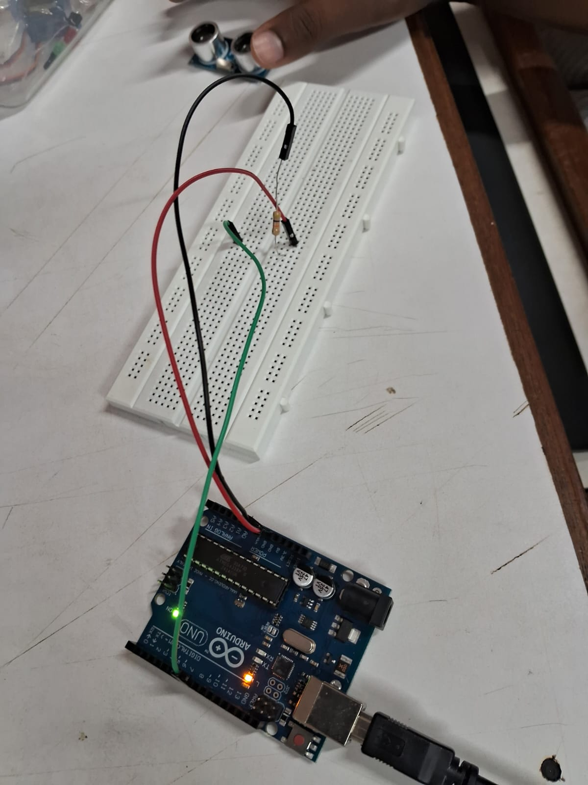

# Smart Posture-Aware Lamp 💡

🚀 A beginner-friendly embedded systems project built during a 3-day university bootcamp. This smart lamp detects motion and helps users correct posture through buzzer alerts and LED lighting using Arduino Uno.

---

## 🔧 Features
- Detects motion using PIR sensor
- Alerts user via buzzer for poor posture/inactivity
- Lights up LED when motion is detected

---

## 🧠 Components Used
- Arduino Uno
- PIR Motion Sensor
- LED
- Buzzer
- Breadboard & Jumper Wires

---

## 🔁 Working Logic
1. PIR detects motion.
2. If motion is detected → LED turns on.
3. If posture remains unchanged → buzzer rings after short delay.
4. No motion = LED off.

---

## 📸 Images

  
  


---

## 💻 Code Snapshot

```cpp
int motionSensor = 2;
int led = 3;
int buzzer = 4;

void setup() {
  pinMode(motionSensor, INPUT);
  pinMode(led, OUTPUT);
  pinMode(buzzer, OUTPUT);
  Serial.begin(9600);
}

void loop() {
  int motion = digitalRead(motionSensor);
  if (motion == HIGH) {
    digitalWrite(led, HIGH);
    delay(1000);
    digitalWrite(buzzer, HIGH);
    delay(500);
    digitalWrite(buzzer, LOW);
  } else {
    digitalWrite(led, LOW);
  }
}
